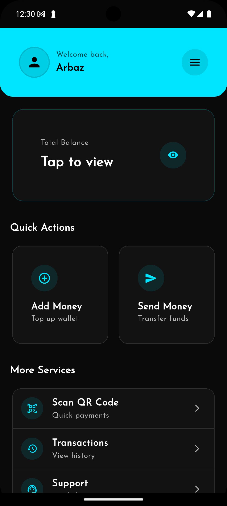

# 💰 XPay - Modern Flutter Payment App

<div align="center">


**A cutting-edge Flutter payment application featuring Material 3 design, neon blue aesthetics, and comprehensive financial services.**

[🚀 Features](#-features) • [📱 Screenshots](#-screenshots) • [🛠️ Installation](#️-installation) • [🎨 Design](#-design-system) • [🔧 Tech Stack](#-tech-stack)

</div>

---

## ✨ Features

### 🏦 **Core Payment Services**
- 💳 **Wallet Management** - Secure digital wallet with real-time balance tracking
- 💰 **Add Money** - Multiple payment gateways for easy top-ups
- 📤 **Send Money** - Instant transfers to contacts and accounts
- 💸 **Money Out** - Withdraw funds to bank accounts
- 🔄 **Currency Exchange** - Multi-currency support with live rates

### 📱 **Smart Features**
- 📷 **QR Code Scanner** - Quick payment processing via QR codes
- 🧾 **Digital Receipts** - Transaction history and invoice generation
- 🎫 **Voucher System** - Create and redeem digital vouchers
- 🔔 **Real-time Notifications** - Instant transaction alerts
- 🔐 **Biometric Security** - Fingerprint and face recognition

### 🎨 **Modern UI/UX**
- 🌙 **Dark Theme** - Eye-friendly dark mode with neon accents
- ⚡ **Material 3 Design** - Latest Google design system implementation
- 🎯 **Intuitive Navigation** - Seamless user experience
- 📱 **Responsive Design** - Optimized for all screen sizes

---

## 📱 Screenshots

<div align="center">

| Dashboard | Balance Card | Quick Actions | Services Menu |
|-----------|--------------|---------------|---------------|
|  |  |  |  |

</div>

---

## 🛠️ Installation

### Prerequisites
- Flutter SDK 3.19.4 or higher
- Dart SDK 2.19.4 or higher
- Android Studio / VS Code
- Firebase account (for backend services)

### Quick Start

```bash
# Clone the repository
git clone https://github.com/Technogeekpro/xpay-app.git
cd xpay-app

# Install dependencies
flutter pub get

# Configure Firebase (see Firebase Setup section)
# Add your google-services.json (Android) and GoogleService-Info.plist (iOS)

# Run the app
flutter run
```

### Firebase Setup

1. **Create a Firebase Project**
   - Go to [Firebase Console](https://console.firebase.google.com/)
   - Create a new project or use existing one

2. **Add Android App**
   ```bash
   # Add your Android package name: com.example.xpay
   # Download google-services.json
   # Place in android/app/
   ```

3. **Add iOS App**
   ```bash
   # Add your iOS bundle ID: com.example.xpay
   # Download GoogleService-Info.plist
   # Place in ios/Runner/
   ```

4. **Enable Services**
   - Authentication (Email/Password, Phone)
   - Firestore Database
   - Cloud Storage
   - Cloud Functions (optional)

---

## 🎨 Design System

### Color Palette

| Color | Hex | Usage |
|-------|-----|-------|
| 🔵 **Primary** | `#00E5FF` | Main actions, highlights |
| 🟢 **Secondary** | `#03DAC6` | Accent elements |
| ⚫ **Background** | `#000000` | App background |
| 🔘 **Surface** | `#121212` | Cards, elevated elements |
| ⚪ **On Primary** | `#000000` | Text on primary color |
| 🔗 **Outline** | `#2D2D2D` | Borders, dividers |

### Typography
- **Primary Font**: Josefin Sans
- **Weights**: 400 (Regular), 500 (Medium), 600 (Semi-Bold), 700 (Bold)
- **Scale**: Following Material 3 type scale

### Components
- **Cards**: 16px border radius, subtle neon borders
- **Buttons**: 12px border radius, elevated design
- **Icons**: Outlined style with 24px size
- **Spacing**: 8px grid system

---

## 🔧 Tech Stack

### **Frontend**
- **Flutter** - Cross-platform framework
- **Material 3** - Google's latest design system
- **GetX** - State management and routing
- **Provider** - State management for user data
- **flutter_screenutil** - Responsive design

### **Backend & Services**
- **Firebase Auth** - User authentication
- **Cloud Firestore** - Real-time database
- **Firebase Storage** - File storage
- **Cloud Functions** - Server-side logic

### **Key Dependencies**
```yaml
dependencies:
  flutter: sdk: flutter
  get: ^4.6.6                    # State management
  provider: ^6.1.2               # State management
  firebase_core: ^3.1.1          # Firebase core
  firebase_auth: ^5.1.1          # Authentication
  cloud_firestore: ^5.0.2        # Database
  google_fonts: ^6.2.1           # Typography
  flutter_screenutil: ^5.9.3     # Responsive design
  qr_code_scanner_plus: ^2.0.10+1 # QR scanning
  image_picker: ^1.1.2           # Image selection
```

---

## 📁 Project Structure

```
lib/
├── binding/              # GetX bindings
├── controller/           # Business logic controllers
├── data/                # Data models and repositories
├── routes/              # App routing configuration
├── utils/               # Utilities and constants
│   ├── custom_color.dart     # Color scheme
│   ├── custom_style.dart     # Text styles
│   ├── dimensions.dart       # Spacing constants
│   └── strings.dart          # String constants
├── views/               # UI screens
│   ├── dashboard/            # Dashboard screens
│   ├── auth/                 # Authentication screens
│   ├── add_money/            # Add money flow
│   ├── transfer_money/       # Transfer screens
│   └── ...                   # Other feature screens
├── widgets/             # Reusable UI components
│   ├── dashboard_option_widget.dart
│   ├── primary_appbar.dart
│   └── ...
└── main.dart           # App entry point
```

---

## 🚀 Features in Detail

### 💳 Wallet Management
- **Multi-currency Support**: USD, EUR, GBP, INR
- **Real-time Balance**: Live balance updates
- **Transaction History**: Detailed transaction logs
- **Security**: Biometric authentication

### 📱 Payment Methods
- **Bank Transfer**: Direct bank account integration
- **Credit/Debit Cards**: Secure card processing
- **Digital Wallets**: PayPal, Google Pay integration
- **Cryptocurrency**: Bitcoin and Ethereum support (coming soon)

### 🔐 Security Features
- **End-to-End Encryption**: All transactions encrypted
- **Two-Factor Authentication**: SMS and app-based 2FA
- **Fraud Detection**: AI-powered fraud prevention
- **PCI DSS Compliant**: Industry-standard security

---

## 🌟 Design Highlights

### Material 3 Implementation
- ✅ **Dynamic Color**: Adaptive color schemes
- ✅ **Motion**: Smooth animations and transitions
- ✅ **Typography**: Readable and accessible fonts
- ✅ **Accessibility**: Screen reader and high contrast support

### Neon Aesthetic
- 🎨 **Vibrant Colors**: Eye-catching neon blue theme
- 🌙 **Dark Mode**: Optimized for low-light usage
- ✨ **Subtle Glows**: Elegant neon accent effects
- 🎯 **High Contrast**: Perfect readability

---

## 📊 Performance

- ⚡ **Fast Loading**: Optimized for quick startup
- 📱 **Smooth Animations**: 60fps UI performance
- 💾 **Efficient Storage**: Minimal memory footprint
- 🔋 **Battery Optimized**: Low power consumption

---

## 🤝 Contributing

We welcome contributions! Please see our [Contributing Guidelines](CONTRIBUTING.md) for details.

### Development Setup
```bash
# Fork the repository
# Clone your fork
git clone https://github.com/YOUR_USERNAME/xpay-app.git

# Create a feature branch
git checkout -b feature/amazing-feature

# Make your changes
# Commit and push
git commit -m "Add amazing feature"
git push origin feature/amazing-feature

# Create a Pull Request
```

---

## 📄 License

This project is licensed under the MIT License - see the [LICENSE](LICENSE) file for details.

---

## 👨‍💻 Author

**Arbaz Kdr** - Flutter Developer
- 🌐 Website: [www.arbazkdr.tk](http://www.arbazkdr.tk)
- 📧 GitHub: [@Technogeekpro](https://github.com/Technogeekpro)
- 📍 Location: Mumbai, India

---

## 🙏 Acknowledgments

- 🎨 **Material Design Team** - For the amazing Material 3 design system
- 🔥 **Firebase Team** - For the robust backend services
- 💙 **Flutter Community** - For the excellent framework and support
- 🎯 **GetX Community** - For the powerful state management solution

---

<div align="center">

**Made with ❤️ and Flutter**


⭐ **Star this repo if you find it helpful!** ⭐

</div>
